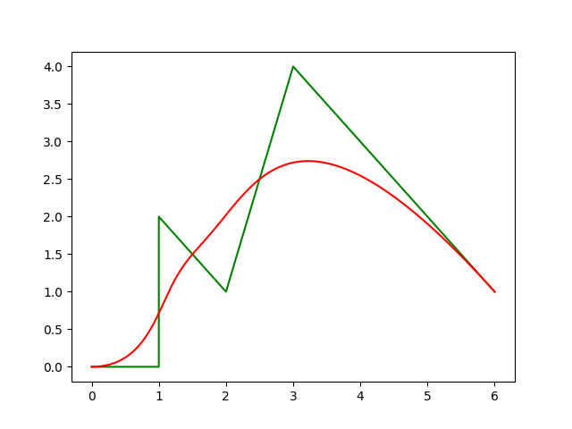
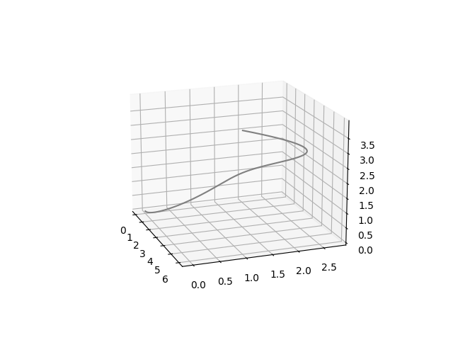

## B-Spline Trajectory Generation

### 1. Introduction
B-Spline trajectory generation and optimization for autonomous navigation for drones. 

### 2. Pre-requisites
Eigen, C++11

### 3. Running the code
bspline.h contains the implementation of cox-deBoor recursive formula for calculation of splines.

git clone https://github.com/deepak-1530/BSplines.git

mkdir build

cd build

cmake .. && make

./main 

#### Plotting the results
Running the executable creates two files -> data.txt and dataControlPoints.txt

These are used in the python script (plotSpline.py)

python3 plotSpline.py

 | 